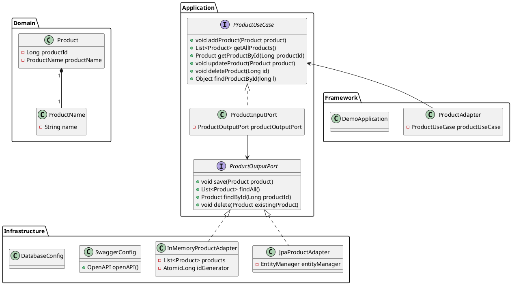
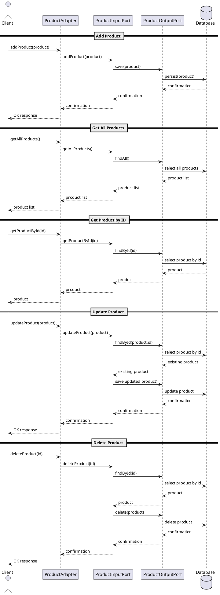

# LDS (Let's practice Swagger UI) 프로젝트

이 프로젝트는 Spring Boot를 사용하여 개발된 제품 관리 시스템의 백엔드 애플리케이션입니다. Swagger UI를 통해 API 문서화를 제공합니다.

## 기술 스택

- Java 17
- Spring Boot 3.1.5
- Gradle 8.6
- H2 Database
- JPA
- Flyway
- Swagger (OpenAPI 3.0)
- Cucumber (BDD 테스트)
- Docker

## 주요 기능

- 제품 추가
- 제품 조회 (전체 및 개별)
- 제품 업데이트
- 제품 삭제

## 프로젝트 구조

프로젝트는 헥사고날 아키텍처를 따르고 있습니다:

- `domain`: 비즈니스 엔티티와 값 객체
- `application`: 유스케이스와 포트 인터페이스
- `infrastructure`: 데이터베이스 어댑터 및 설정
- `framework`: REST API 어댑터

## 주요 파일

- `src/main/java/com/stoneistudio/lds/application/port/in/ProductInputPort.java`: 제품 관련 비즈니스 로직을 처리하는 포트
- `src/main/java/com/stoneistudio/lds/domain/value/ProductName.java`: 제품 이름을 나타내는 값 객체
- `src/main/java/com/stoneistudio/lds/infrastructure/repository/JpaProductAdapter.java`: JPA를 사용한 제품 저장소 어댑터
- `src/test/java/com/stoneistudio/lds/steps/ProductSteps.java`: Cucumber 테스트 스텝 정의
- `src/test/resources/features/product_input_port.feature`: 제품 입력 포트 관련 기능 테스트 시나리오
- `src/test/resources/features/product.feature`: 제품 관리 기능 테스트 시나리오
- `src/test/java/com/stoneistudio/lds/CucumberTest.java`: Cucumber 테스트 설정
- `src/test/java/com/stoneistudio/lds/adapters/ProductAdapterTest.java`: 제품 어댑터 테스트
- `src/test/java/com/stoneistudio/lds/DemoApplicationTests.java`: 애플리케이션 컨텍스트 로드 테스트

## 설치 및 실행

### Gradle을 사용한 실행

1. 프로젝트 루트 디렉토리에서 다음 명령어를 실행하여 애플리케이션을 빌드합니다:

   ```bash
   ./gradlew build
   ```

2. 빌드가 완료되면 다음 명령어를 실행하여 애플리케이션을 실행합니다:

   ```bash
   ./gradlew bootRun
   ```

### Docker를 사용한 실행

1. 프로젝트 루트 디렉토리에서 다음 명령어를 실행하여 도커 컨테이너를 빌드하고 실행합니다:

   ```bash
   docker build -t lds .
   docker run -p 8080:8080 lds
   ```

2. 웹 브라우저에서 `http://localhost:8080/swagger-ui/index.html`로 이동하여 Swagger UI를 확인합니다.

## API 문서

Swagger UI를 통해 제공되는 API 문서는 다음과 같습니다:

- `GET /api/products`: 모든 제품 조회
- `GET /api/products/{id}`: 특정 제품 조회
- `POST /api/products`: 제품 추가
- `PUT /api/products/{id}`: 제품 업데이트
- `DELETE /api/products/{id}`: 제품 삭제

## Test 실행 방법

```bash
./gradlew test
```

## 데이터베이스

프로젝트는 기본적으로 H2 인메모리 데이터베이스를 사용합니다. Flyway를 통해 데이터베이스 마이그레이션을 관리합니다.

## 프로파일

- `default`: 실제 환경 설정
- `test`: 테스트 환경 설정 (인메모리 저장소 사용)

## 기여

프로젝트에 기여하고 싶으시다면 풀 리퀘스트를 보내주세요. 모든 기여는 환영합니다!

## 라이선스

이 프로젝트는 소스 비공개 정책에 따라 배포됩니다.

## UML 다이어그램

이 프로젝트의 UML 다이어그램은 다음과 같습니다:

### 클래스 다이어그램


### 시퀀스 다이어그램


